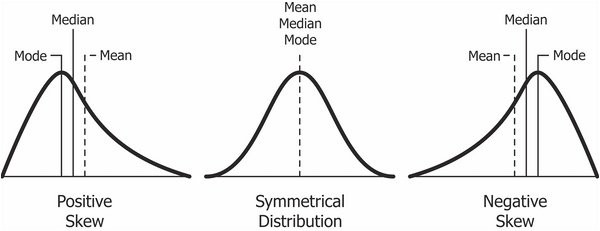
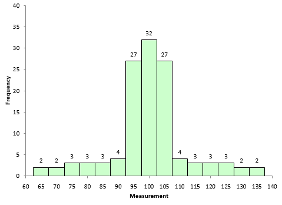

# Skewness and Kurtosis

We have previously identified a normal distribution to be symmetrical in shape. But this may not be the case most of the time when dealing real world data. This lesson will cover the attributes of a normal distribution that define how much "out-of-shape" it is. 

## Objectives
Students would be able to:

* Understand the concept of symmetrical distribution
* Calculate and describe skewness and kurtosis as measures of non-symmetry

### Symmetric Distributions

A distribution is symmetric if the relative frequency or probability is the same at equal distances from the point of symmetry . The point of symmetry for normal distributions would be the center of that distribution i.e. the mean. We can refer to the point of symmetry as **𝛼**. 

The mean and median are equal and occur at 𝛼 where 𝛼 represents the point that the distribution is symmetric about its mean. Also the mode is equal to the mean and median if the distribution is both symmetric and unimodal (unimodal means that the distribution only has one value that occurs the most, one peak).

For example have a look at following histogram we saw when discussing measures of central tendency:

This distribution meets all of the conditions of being symmetrical. 

The most common symmetric distribution is the normal distribution, however there are a number of other distributions that are symmetric. [Here is a good article](chttps://www.statisticshowto.datasciencecentral.com/symmetric-distribution-2/) that looks into all sorts of symmetrical distributions. We shall focus on normal distributions here and see how these can lose symmetry.

## Skewness

Skewness is the degree of distortion or deviation from the symmetrical bell curve that is a key characteristic of a normal distribution. Skewness can be seen as a measure to calculate lack of symmetry in data distribution.

Skewness helps you identify extreme values in one versus the other tail. A symmetrical distribution will have a skewness of 0. There are two types of Skewness: Positive and Negative

#### Positive Skewness

Positive Skewness is present in a distribution when the tail on the right side of the distribution is longer (or fatter - as it is normally called). The mean and median will be greater than the mode.

#### Negative Skewness
Negative Skewness is present in a distribution when the tail of the left side of the distribution is longer or fatter than the tail on the right side. The mean and median will be less than the mode.

This behavior is shown in the images below:

Here the fact that mean is not the same as median and mode anymore brings in consequences for data analysis. The normality assumption that we associate with a given data data for analysis does not hold true when these situations happen. Later we shall see how to deal with such distributions. 

#### Measuring Skewness

For univariate data Y1, Y2, ..., YN, the formula for skewness is:

**Skewness= ∑ Ni=1 (Yi−Y)3 / N)/s3**

where Y¯ is the mean, s is the standard deviation, and N is the number of data points. Note that in computing the skewness. The above formula for skewness is referred to as the **Fisher-Pearson coefficient of skewness**. There are also other ways to calculate skewness but this one is used mostly commonly. 

### When is the skewness too much?

The rule of thumb seems to be:

* If the skewness is between -0.5 and 0.5, the data are fairly symmetrical.
* If the skewness is between -1 and -0.5(negatively skewed) or between 0.5 and 1(positively skewed), the data are moderately skewed.
* If the skewness is less than -1(negatively skewed) or greater than 1(positively skewed), the data are highly skewed.

**Example**

Suppose we have house values ranging from $100k to $1,000,000 with the average being $500,000 in a given house prices dataset. 

If the peak of the distribution was left of the average value, portraying a positive skewness in the distribution. It would mean that many houses were being sold for less than the average value, i.e. $500k. This could be for many reasons, but we are not going to interpret those reasons here.

If the peak of the distributed data was right of the average value, that would mean a negative skew. This would mean that the houses were being sold for more than the average value as shown below.

## Kurtosis

Kurtosis deals with the lengths of tails in the distribution. There is general misconception that kurtosis is a measure of "peakedness" in a distributions. Well kurtosis is not really the peakedness or flatness. It is used to describe the extreme values in one versus the other tail. It is actually the **measure of outliers** present in the distribution.

Here we see that long tails are generally due to errors in the measurement as the peaks of the data (correct values) are all centred around the mean of the distribution. Long tails here are the signs that apart of correct measurements, we also have data about outliers present in our dataset. 

#### Measuring Kurtosis

For univariate data Y1, Y2, ..., YN, the formula for kurtosis is:

**kurtosis =∑ N(i=1) (Yi−Y¯)4 / N / s4**

If there is a high kurtosis, then, we need to investigate why do we have so many outliers. 
Presence of outliers could be indications of errors OR some interesting observations that may need to be explored further. Remember for banking transactions, an outliers might signify a possible fraudulent activity. How we deal with outliers depends mainly on the domain. 
So always Investigate!

Low kurtosis in a data set is an indicator that data has light tails or lack of outliers. If we get low kurtosis(too good to be true), then also we need to investigate and trim the dataset of unwanted results.

### How much kurtosis is bad kurtosis ?

#### Mesokurtic 

This distribution has kurtosis statistic similar to that of the normal distribution. It means that the extreme values of the distribution are similar to that of a normal distribution characteristic. This definition is used so that the standard normal distribution has a kurtosis of three.

#### Leptokurtic (Kurtosis > 3)

Distribution is longer, tails are fatter. Peak is higher and sharper than Mesokurtic, which means that data are heavy-tailed or profusion of outliers. 
Outliers stretch the horizontal axis of the histogram graph, which makes the bulk of the data appear in a narrow (“skinny”) vertical range, thereby giving the “skinniness” of a leptokurtic distribution.

#### Platykurtic: (Kurtosis < 3) 

Distribution is shorter, tails are thinner than the normal distribution. The peak is lower and broader than Mesokurtic, which means that data are light-tailed or lack of outliers.
The reason for this is because the extreme values are less than that of the normal distribution.

## Summary 

In this lesson, we learned about the characteristics of distributions( specifically normal distribution) that identify the level of non-symmetry and presence of consistent outliers in the data. Next we shall see how to measure skewness and kurtosis in python. 
